# Local AI LLM for SOC Operations with Splunk Enterprise Security

> **Series: Leveraging Local AI/LLM for SOC Operations — EP1: Incident Triage**

## Background

Many organizations running Splunk Enterprise Security (ES) face a common set of obstacles that prevent them from adopting cloud-based AI tools:

- **Air-gapped environments** — no internet connectivity allowed
- **Data residency requirements** — security data must remain on-premises
- **AI governance gaps** — internal policies not yet established for cloud AI usage
- **Privacy and security concerns** — sending alert data to external AI services is not acceptable

This guide demonstrates how to address these challenges using **local open-source LLMs**, **free Splunk apps**, and **data your team already has** — with minimal additional cost.

---

## Architecture

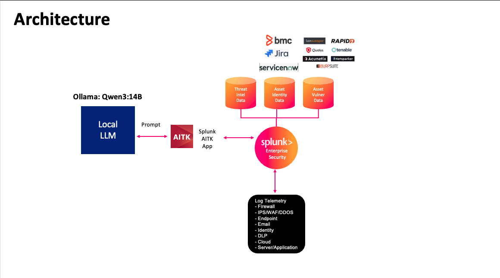

> **Local LLM** (Ollama) receives prompts from Splunk via the **AITK App**. Splunk ES ingests log telemetry from multiple sources (Endpoint, Firewall, Email, Cloud, etc.) and is enriched with **Threat Intel**, **Asset/Identity**, and **Vulnerability** data from tools like Rapid7, Tenable, BMC, Jira, and ServiceNow.

---

## EP1: AI-Powered Incident Triage

### Problem Statement

SOC analysts using Splunk ES commonly face:

1. High alert volume — noise and false positives consume analyst time with little productivity gain
2. Increased MTTD/MTTR for real incidents due to alert fatigue
3. Context is fragmented — asset data, identity data, and vulnerability information live in separate systems
4. Analysts must pivot across multiple tools and consoles to make a single triage decision

### Solution

Consolidate all relevant incident context into Splunk ES and use a **local LLM** to analyze it — delivering AI-generated triage verdicts, confidence scores, reasoning, and suggested actions directly inside the analyst's existing workflow.

**What the AI produces for each finding:**
- ✅ Verdict: True Positive / False Positive with confidence score
- ✅ Reasoning: evidence-backed explanation (English + Thai language supported)
- ✅ Suggested next steps: investigation and remediation actions

**Demo video:** [`file/Demo_AI_Triage.mov`](file/Demo_AI_Triage.mov)

---

## Architecture Overview

```
[EDR / Data Sources] → [Splunk ES index=notable]
                              ↓
              [Scheduled SPL Search + AITK ai command]
                              ↓
                    [Local Ollama LLM]  ←── runs fully on-prem
                              ↓
                  [KV Store: ai_triage_lookup]
                              ↓
         [Auto Lookup] → [ES Analyst Queue] + [AI Triage Dashboard]
```

---

## Prerequisites & Cost

| Component | Cost | Notes |
|---|---|---|
| Splunk Enterprise Security | Existing license | Already deployed |
| [AITK App](https://splunkbase.splunk.com/app/2890) | Free | Install from Splunkbase |
| [Ollama](https://ollama.com) | Free / Open Source | Local LLM runtime |
| LLM Model (Qwen3, DeepSeek-R1, GLM-Z1, etc.) | Free / Open Source | Pull via Ollama |
| GPU Hardware | **Cost** | Spec depends on model size and concurrent usage |

> Start with Qwen3:8B or DeepSeek-R1:8B for a balance of performance and hardware requirements. A GPU with 12–16 GB VRAM is sufficient for single-user demo environments.

---

## Use Case: Suspicious Process Execution from EDR

### Typical Analyst Triage Workflow (Before AI)

1. Interpret the executed command, process, and process chain
2. Decode any encoded (Base64) commands manually
3. Identify the attack technique or exploitation method
4. Check identity context: user priority, business unit, role
5. Check asset context: criticality, category, owner
6. Check whether the asset has vulnerabilities related to the observed technique
7. Conclude: True Positive or False Positive

This process is time-consuming, requires deep expertise, and is repeated for every alert.

### With Local AI Triage

The analyst sees the verdict, confidence score, reasoning, and suggested actions directly in the ES Analyst Queue — without leaving the platform or manually pivoting across tools.

| Before | After |
|---|---|
|  |  |

---

## Deployment Guide

### Step 1 — Bring Context Data into Splunk ES

The AI needs enriched context to make accurate decisions. Ingest the following data sources:

**Asset Information (from CMDB)**
- Configure in ES: Settings → Asset & Identity Management → Assets
- Reference: [Splunk ES Asset and Identity Management](https://help.splunk.com/en/splunk-enterprise-security-8/administer/8.2/asset-and-identity-management/add-asset-and-identity-data-to-splunk-enterprise-security)


**Identity Information (from Identity Provider / HR system)**
- Configure in ES: Settings → Asset & Identity Management → Identities


**Asset Vulnerability Data (from VA Scanner)**
- Rapid7 InsightVM: [Rapid7 Technology Add-on for Splunk](https://docs.rapid7.com/insightvm/insightvm-technology-add-on-for-splunk/)
- Tenable: [Tenable and Splunk Integration Guide](https://docs.tenable.com/integrations/Splunk/Content/PDF/Tenable_and_Splunk_Integration_Guide.pdf)


---

### Step 2 — Install and Configure Ollama

Install Ollama and pull a cybersecurity-capable LLM model:

```bash
# Install Ollama (macOS/Linux)
curl -fsSL https://ollama.com/install.sh | sh

# Pull a model — choose based on your GPU VRAM
ollama pull qwen3:8b          # ~8 GB VRAM
ollama pull deepseek-r1:8b    # ~8 GB VRAM

# Start Ollama server (default: http://localhost:11434)
ollama serve
```

Reference: [Ollama Quickstart](https://docs.ollama.com/quickstart)

---

### Step 3 — Install AITK App and Connect to Ollama

1. Download and install [AI Toolkit (AITK)](https://splunkbase.splunk.com/app/2890) from Splunkbase
2. In Splunk: Apps → AI Toolkit → Connections → New Connection
3. Set connection type to **Ollama**, URL: `http://localhost:11434`
4. Test the connection and save

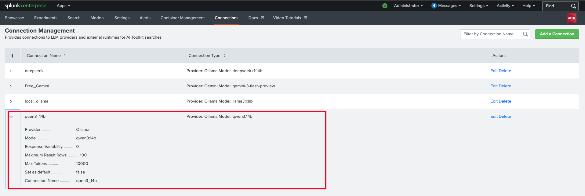

Reference: [AITK Connections Tab](https://help.splunk.com/en/splunk-cloud-platform/apply-machine-learning/use-ai-toolkit/5.7.2/ai-toolkit-commands-macros-and-visualizations/connections-tab-in-the-ai-toolkit)

---

### Step 4 — Build the AI Triage Scheduled Search

Create a scheduled search that:
1. Pulls recent notable events from `index=notable`
2. Joins identity, asset, and vulnerability context
3. Sends the combined context to the LLM via `| ai` command
4. Parses the AI response and writes to KV Store

**Key SPL pattern:**

```spl
index=notable earliest=-15m
| eval entity=coalesce(user, src, dest)
| lookup identity_lookup identity AS entity OUTPUT priority, bunit, category
| lookup asset_lookup asset AS dest OUTPUT priority AS dest_priority
| join type=left dest [search index=vuln | stats values(cve) AS cves, max(cvss) AS max_cvss by dest]
| eval prompt="Analyze this security incident and determine if it is a True Positive or False Positive.
  Process: ".process."
  Parent Process: ".parent_process."
  Command: ".process_cmd."
  User: ".entity." | Priority: ".priority." | Business Unit: ".bunit."
  Asset Vulnerabilities: ".cves." | Max CVSS: ".max_cvss."
  Provide: 1) Verdict (TP/FP) 2) Confidence score 0-100 3) Reasoning in English 4) Reasoning in Thai 5) Suggested next steps"
| ai connection="ollama" model="qwen3:8b" prompt_field=prompt
| ... (parse response fields)
| outputlookup append=true ai_triage_lookup
```

> You will spend time here testing and fine-tuning the prompt to improve accuracy for your environment.

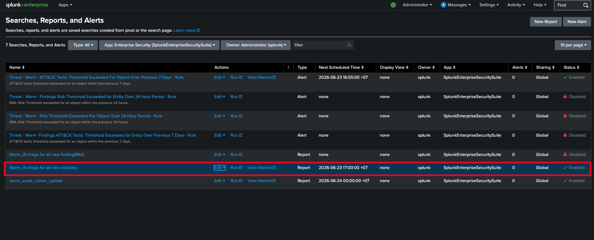
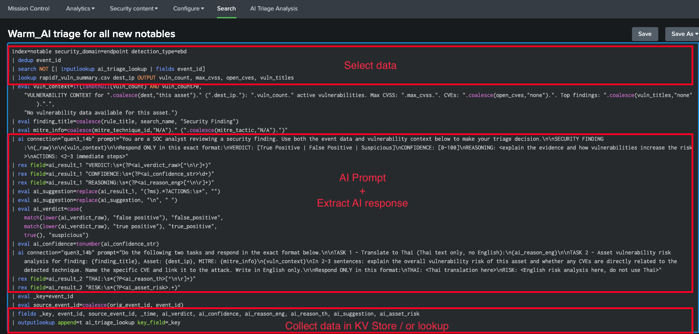

Reference: [AITK `ai` command documentation](https://help.splunk.com/en/splunk-cloud-platform/apply-machine-learning/use-ai-toolkit/5.7.4/ai-toolkit-commands-macros-and-visualizations/about-the-ai-command)

---

### Step 5 — Create KV Store to Store AI Triage Results

Create a KV Store collection to persist AI triage results, keyed by `event_id`.

**transforms.conf** — add to your ES app's `local/transforms.conf`:

```ini
[ai_triage_lookup]
collection = ai_triage_lookup
type = kvstore
external_type = kvstore
fields_list = _key, event_id, ai_verdict, ai_confidence, ai_reason_eng, ai_reason_th, ai_suggestion
```

Restart Splunk or reload lookups after editing:

```bash
/Applications/Splunk/bin/splunk restart
```

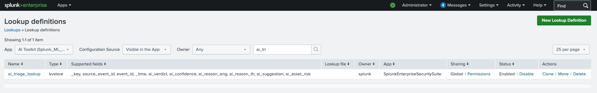

Reference: [Configure KV Store Lookups](https://help.splunk.com/en/splunk-enterprise/manage-knowledge-objects/knowledge-management-manual/10.4/use-the-configuration-files-to-configure-lookups/configure-kv-store-lookups)

---

### Step 6 — Surface AI Results in the ES Analyst Queue

#### 6.1 — Create an Automatic Lookup

Map `event_id` from each notable event to the AI triage fields automatically.

Settings → Lookups → Automatic Lookups → New:
- Lookup table: `ai_triage_lookup`
- Apply to: `sourcetype = stash` (or your notable sourcetype)
- Input field: `event_id`
- Output fields: `ai_verdict`, `ai_confidence`, `ai_reason_eng`, `ai_reason_th`, `ai_suggestion`

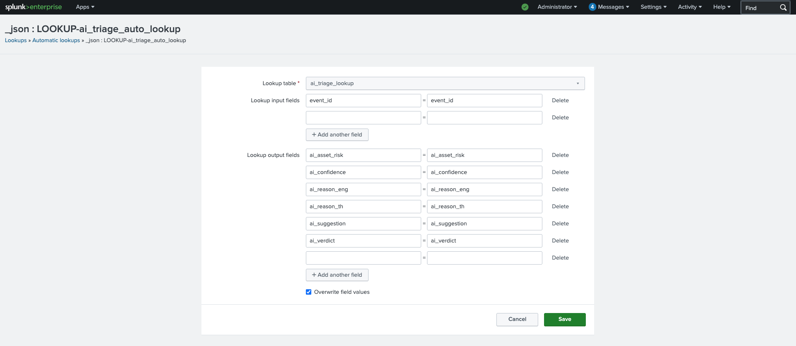

Reference: [Make Your Lookup Automatic](https://help.splunk.com/en/splunk-enterprise/manage-knowledge-objects/knowledge-management-manual/9.4/use-the-configuration-files-to-configure-lookups/make-your-lookup-automatic)

#### 6.2 — Add Fields to Finding Configuration

ES → Configure → Findings and Investigations → Field Values for Findings → Add fields:
- `ai_verdict`
- `ai_confidence`
- `ai_reason_eng`
- `ai_reason_th`
- `ai_suggestion`

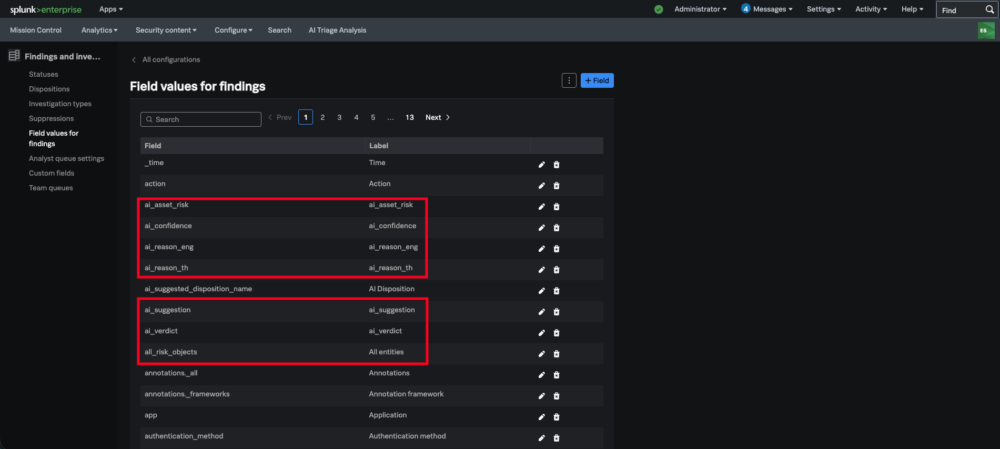

Reference: [Modify Fields for Findings in ES](https://help.splunk.com/en/splunk-enterprise-security-8/administer/8.5/investigations/modify-the-fields-for-findings-in-splunk-enterprise-security)

#### 6.3 — Add Fields to Analyst Queue Table

Mission Control → Analyst Queue → Table Settings → add desired AI fields as visible columns.


Reference: [Customize Table Settings for the Analyst Queue](https://help.splunk.com/en/splunk-enterprise-security-8/administer/8.0/mission-control/customize-table-settings-for-the-analyst-queue-in-splunk-enterprise-security)

---

### Step 7 — (Optional) Build a Dedicated AI Triage Dashboard

The Analyst Queue table has limited space. A dedicated dashboard gives analysts the full picture — AI verdict, reasoning, asset vulnerability data, and event context in one view.

#### 7.1 — Build the Dashboard

Create a dashboard using data from the KV Store (`ai_triage_lookup`) combined with vulnerability data. The dashboard XML (`ai_triage_analysis.xml`) is included in this repository.

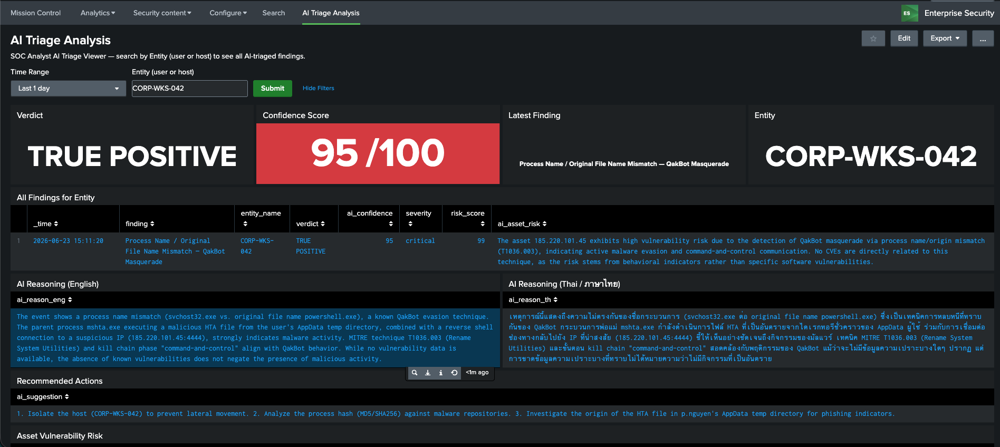
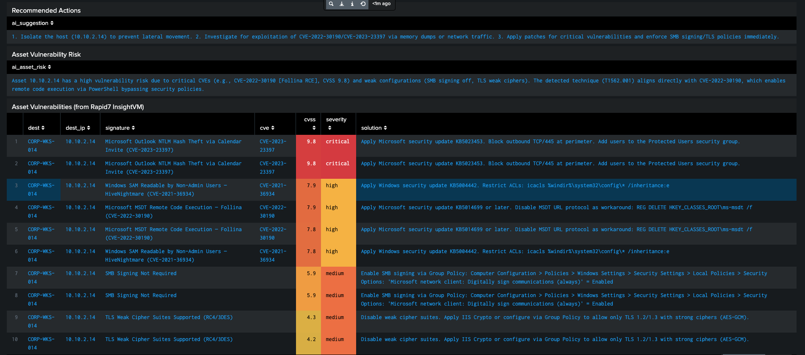

#### 7.2 — Add the Dashboard to ES

ES → Configure → General → Views → Add New View → point to your dashboard.

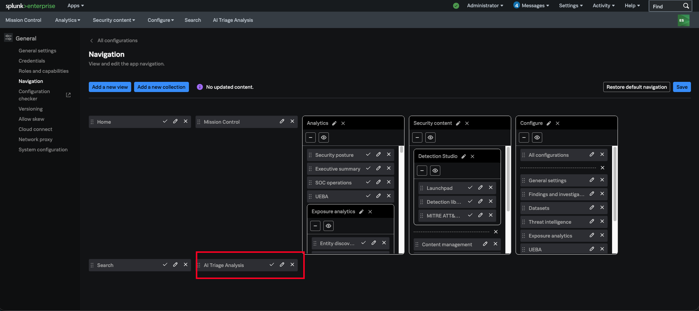

Reference: [Create and Manage Views in Splunk ES](https://help.splunk.com/en/splunk-enterprise-security-8/administer/8.0/managing-security-content/create-and-manage-views-in-splunk-enterprise-security)

#### 7.3 — Add a Workflow Action to Launch the Dashboard

Create a workflow action on notable events to open the AI Triage dashboard pre-filtered to the selected entity.

Settings → Fields → Workflow Actions → New:
- Apply to: `index=notable`
- Action type: Link (GET)
- URI: `/app/SplunkEnterpriseSecuritySuite/ai_triage_analysis?form.entity_tok=$entity$`

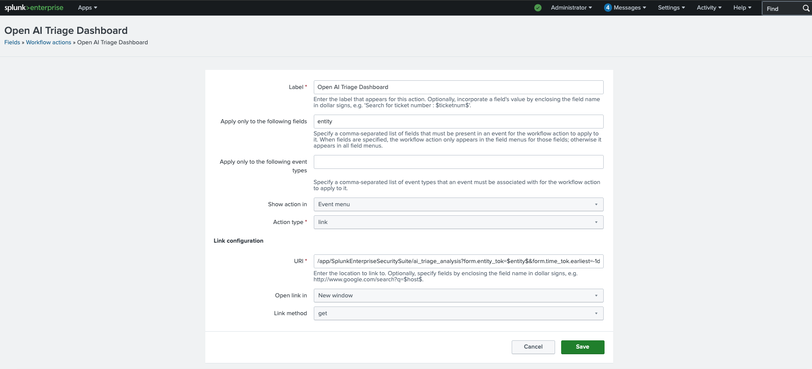
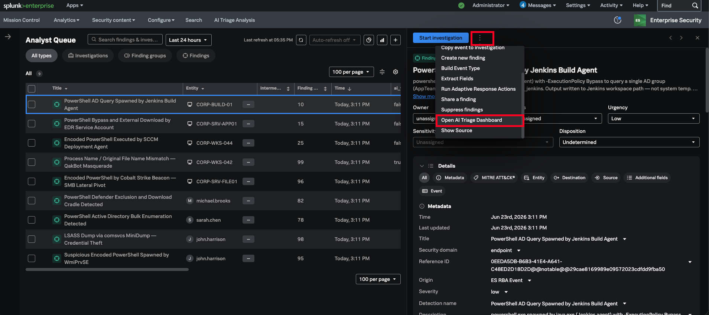

Reference: [Set Up a GET Workflow Action](https://help.splunk.com/en/splunk-enterprise/manage-knowledge-objects/knowledge-management-manual/10.4/workflow-actions/set-up-a-get-workflow-action)

---

## Files in This Repository

| File | Description |
|---|---|
| `README.md` | Full deployment guide (this document) |
| `file/` | Screenshots referenced in this guide |

---

## Expected Outcome

Before and after comparison:

| | Before | After |
|---|---|---|
| Analyst Queue | Raw alerts, no context | AI verdict + confidence score visible inline |
| Triage time | Manual pivot across tools | Context pre-correlated, AI pre-analyzed |
| Decision support | Analyst judgment only | AI reasoning + suggested next steps |
| Language support | English only | English + Thai |

---

---

## References

- [Splunk AI Toolkit (AITK) on Splunkbase](https://splunkbase.splunk.com/app/2890)
- [Ollama Documentation](https://docs.ollama.com/quickstart)
- [AITK `ai` Command Reference](https://help.splunk.com/en/splunk-cloud-platform/apply-machine-learning/use-ai-toolkit/5.7.4/ai-toolkit-commands-macros-and-visualizations/about-the-ai-command)
- [Splunk ES Asset and Identity Management](https://help.splunk.com/en/splunk-enterprise-security-8/administer/8.2/asset-and-identity-management/add-asset-and-identity-data-to-splunk-enterprise-security)
- [Rapid7 InsightVM Add-on for Splunk](https://docs.rapid7.com/insightvm/insightvm-technology-add-on-for-splunk/)
- [Tenable and Splunk Integration Guide](https://docs.tenable.com/integrations/Splunk/Content/PDF/Tenable_and_Splunk_Integration_Guide.pdf)
- [Splunk ES Findings Configuration](https://help.splunk.com/en/splunk-enterprise-security-8/administer/8.5/investigations/modify-the-fields-for-findings-in-splunk-enterprise-security)
- [Splunk Analyst Queue Customization](https://help.splunk.com/en/splunk-enterprise-security-8/administer/8.0/mission-control/customize-table-settings-for-the-analyst-queue-in-splunk-enterprise-security)
